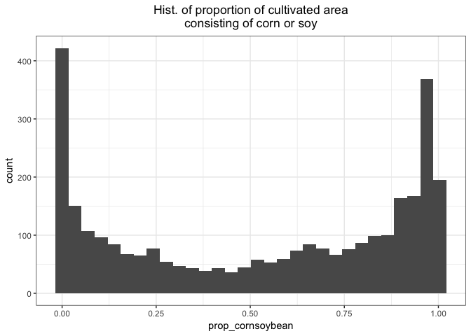
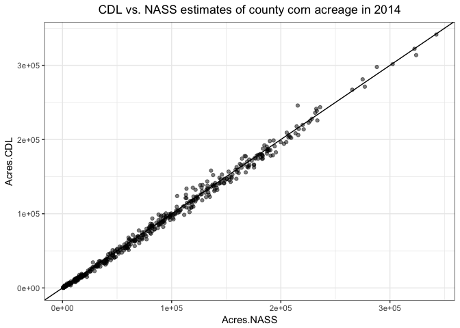
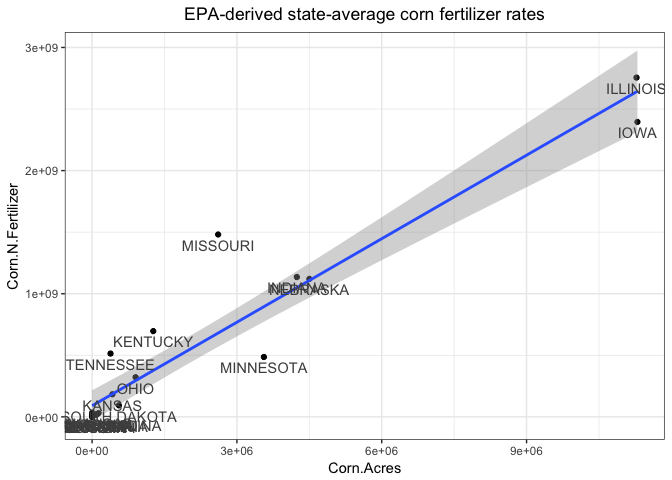
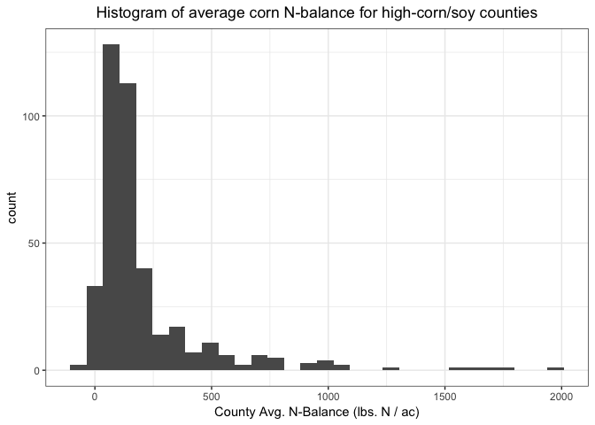
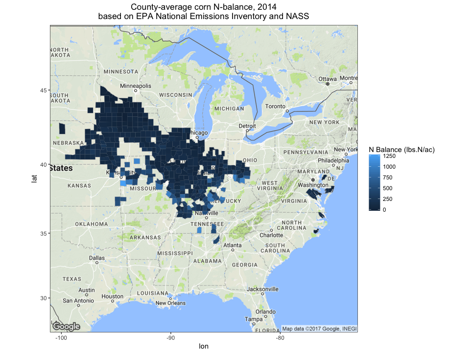

Create County-Average Corn Nitrogen-Balance Estimates from Public Datasets
================
Kenneth Qin
2017-07-14

Background
----------

The main barrier to successfully deploying a targeted fertilizer conservation program for commodity crops is the lack of sufficiently high-coverage, high-resolution fertilizer application data. In theory, if we could receive annual reports of yield, crop type, and nitrogen (N) fertilizer application rate from each field in the U.S., we could develop a crude N-balance prediction system that operates at the field-scale. However, this data is elusive in part because of the prevalent concern for farmers' privacy rights. A 2013 [study](http://www.tandfonline.com/doi/abs/10.1080/08941920.2012.671450) from Iowa State University reported that "30% of farmers agreed that government use of remote sensing and other tools to identify issues on private land is an invasion of privacy" (Arbuckle).

Thus in this pilot project, **we do not attempt to calculate any field-scale attributes**. Instead, we attempt to predict the mean and heterogeneity of **N-balance for corn fields at the county scale**. In theory, once corn N-balance has been calculated for each county, we will have created a dataset that can be used to validate independent predictions of **county-level** N-balance. Such a model would allow for semi-targeted conservation programs that enroll counties instead of individual farmers.

Data Sources
------------

County-scale estimates of total N fertilizer usage was made available in the EPA's National Emissions Inventory (NEI) reports for 2014; these estimates were based on modeled crop demand (see their [Technical Support Document](https://www.epa.gov/air-emissions-inventories/2014-national-emissions-inventory-nei-technical-support-document-tsd)). When combined with the [Cropland Data Layer's](https://nassgeodata.gmu.edu/CropScape/) pixel counts of each land cover type for each county, we can identify those counties where the vast majority (e.g. &gt; 0.95) of all cultivated area consists of corn/soybean, and make the assumption that all N fertilizer within the county was applied to corn acreage. Through this process we can arrive at a **county-average fertilizer application rate for corn** for a subset of counties.

County-level production (and yield) data can be retrieved from the USDA National Agricultural Statistics Service (NASS) via [Quick Stats](https://quickstats.nass.usda.gov/).

**County-level N-balance for corn** can then be calculated through the following equation:

*N*.*b**a**l**a**n**c**e* = *N*.*i**n**p**u**t* − *N*.*o**u**t**p**u**t* = *N*.*i**n**p**u**t* − *C**r**o**p*.*P**r**o**d**u**c**t**i**o**n* \* *N*.*r**e**m**o**v**a**l*.*r**a**t**e*

This simplified N-balance equation is sufficient for our purpose of estimating county-level corn N-balance, though we recognize that we are making the following assumptions:

-   Corn stover / stubble is not removed from the field.
-   The grain has the standard moisture content of 15.5%.
-   The grain has a constant N concentration of 1.4%.

See the International Plant Nutrition Institute's (IPNI's) [website](http://www.ipni.net/article/IPNI-3296) for details on the grain N calculation.

Analysis
--------

Define constants, load libraries, and import data.

``` r
# Constants

SQ_METER_PER_PIXEL <- 900
SQ_METER_PER_ACRE <- 4046.86
ACRES_PER_SQ_MILE <- 640
LBS_PER_TON <- 2000
LBS_N_REMOVED_PER_BU_CORN <- 0.67 # From IPNI
THRESHOLD_CORNSOY <- 0.95 # For high-corn/soy county
MIN_CORN_ACRES <- 9000 # To reduce variability of area-scaled N-balances

# Libraries

library(dplyr)
library(stringr)
library(reshape2)
library(ggplot2)
library(ggmap)
theme_set(theme_bw())

# Data imports

fips <- read.csv("fips_codes.csv")

CDL2014 <- read.csv("CDL_Cnty_Pixel_2014_30m.csv")

CDL.names <- read.csv("CDL_class_names.csv")
cultivated.codes <- CDL.names$CODE[which(CDL.names$CULTIVATED)]
cultivated.codes.str <- str_pad(cultivated.codes, 3, side="left", "0")
cultivated.cats <- paste("Category_", cultivated.codes.str, sep="")

Corn2014 <- read.csv("NASS_corn_county_production_2014.csv")

Corn.Fertilizer.State.2014.NASS <- read.csv("NASS_corn_nitrogen_rate_2014.csv")
Fertilizer.County.2014.EPA <- read.csv("EPA_fertilizer_county_2014.csv")
```

### Part 1: Find counties where (nearly) all fertilizer was applied to corn

The assumption is that in counties where (nearly) the only crops are corn and soybean, (nearly) all fertilizer should have been applied to corn.

The easiest way to identify these counties is using the **Cropland Data Layer's** county pixel counts for each crop type.

Merge county pixel-count data with county FIPS-code data.

``` r
fips$Fips <- fips$STATEFP*1000 + fips$COUNTYFP
CDL2014.m <- merge(fips, CDL2014, by="Fips")
```

Convert pixel-counts into sq. miles and acres.

``` r
CDL2014.sqm <- CDL2014.m
CDL2014.sqm[1:nrow(CDL2014.sqm),8:ncol(CDL2014.sqm)] <- 
  CDL2014.sqm[1:nrow(CDL2014.sqm),8:ncol(CDL2014.sqm)] * SQ_METER_PER_PIXEL

CDL2014.ac <- CDL2014.sqm
CDL2014.ac[1:nrow(CDL2014.ac),8:ncol(CDL2014.ac)] <- 
  CDL2014.ac[1:nrow(CDL2014.ac),8:ncol(CDL2014.ac)] / SQ_METER_PER_ACRE
```

Calculate total area and total cultivated area in each county.

``` r
CDL2014.ac$Total_ac <- rowSums(select(CDL2014.ac, Category_001:Category_254))
CDL2014.ac$Total_sqmi <- CDL2014.ac$Total_ac/ACRES_PER_SQ_MILE

CDL2014.ac$Total_cult_ac <- rowSums(select(CDL2014.ac, one_of(cultivated.cats)))
```

    ## Warning in one_of(cultivated.cats): Unknown variables: `Category_051`,
    ## `Category_210`

``` r
CDL2014.ac$Total_cult_sqmi <- CDL2014.ac$Total_cult_ac/ACRES_PER_SQ_MILE

# Ensure that cultivated area is less than total area
prop.cultivated <- CDL2014.ac$Total_cult_ac / CDL2014.ac$Total_ac
range(prop.cultivated)
```

    ## [1] 0.0000000 0.9029783

Calculate proportion of corn+soybean out of total CULTIVATED AREA.

``` r
CDL2014.ac.select <- select(CDL2014.ac, -(Category_001:Category_254))

CDL2014.ac.select %>%
  mutate(prop_corn = Corn_all / Total_cult_ac,
         prop_soybean = Soybeans_all / Total_cult_ac,
         prop_cornsoybean = (Corn_all + Soybeans_all) / Total_cult_ac) ->
  CDL2014.ac.select

hist(CDL2014.ac.select$prop_cornsoybean, main="Hist. of proportion of cultivated area\nconsisting of corn or soy")
```



Identify counties with over 0.95 of cultivated acres consisting of corn or soy.

First, what proportion of counties have over 0.95 of their cultivated acreage consist of corn or soy?

``` r
# Answer: For 98% threshold, 9.5% of counties (N=295).
#         For 95% threshold, 18% of counties (N=575).
#         For 90% threshold, 26% of counties (N=813).
mean(CDL2014.ac.select$prop_cornsoybean > THRESHOLD_CORNSOY, na.rm=TRUE)
```

    ## [1] 0.1852448

``` r
# Record these counties' fips codes
ind.hicornsoy.cornsoy <- which(CDL2014.ac.select$prop_cornsoybean > THRESHOLD_CORNSOY)
cornsoy.counties.fips <- CDL2014.ac.select$Fips[ind.hicornsoy.cornsoy]
```

Where are these counties?

``` r
# Where are these counties?
CDL2014.ac.select[ind.hicornsoy.cornsoy,] %>%
  group_by(STATE) %>%
  summarise(state_n = n()) %>%
  arrange(desc(state_n)) ->
  CDL.hicornsoy.statecount
CDL.hicornsoy.statecount
```

    ## # A tibble: 22 × 2
    ##     STATE state_n
    ##    <fctr>   <int>
    ## 1      IL      99
    ## 2      IA      76
    ## 3      KY      74
    ## 4      IN      71
    ## 5      MO      68
    ## 6      TN      55
    ## 7      NE      35
    ## 8      MN      22
    ## 9      OH      22
    ## 10     VA      14
    ## # ... with 12 more rows

What else do these counties grow? Are we justified in multiplying total N fertilizer application by the proportion of corn/soybean acreage to arrive at total N fertilizer application to corn?

``` r
# What are the other crops in these counties?
CDL2014.ac.select[ind.hicornsoy.cornsoy,] %>%
  select(Corn_all:Lettuce_all) %>%
  summarise_each(funs(sum)) ->
  temp
ggplot(melt(temp), aes(x=variable, y=value)) + geom_bar(stat='identity') +
  theme(axis.text.x = element_text(angle=90, hjust=1)) + 
  ggtitle("Crop Acreage Distributions within High-Corn/Soy Counties")
```

    ## No id variables; using all as measure variables


Aside from corn and soybean, these counties also grow a substantial amount of winter wheat. Winter wheat demands almost twice as much N as corn, which may bias the corn N-balance downwards if total N applications are multiplied by the proportion of corn/soybean acreage within each county. However, these crops only make up to 0.05 of total acreage in these counties.

### Part 2: Compare Datasets Against NASS 2014 Corn Data

#### Calibration Checkpoint 1: How well does CDL acreage data compare to NASS acreage data?

First create standard FIPS code within Corn data.

``` r
Corn2014$Fips <- Corn2014$State.ANSI*1000 + Corn2014$County.ANSI
```

Reshape Corn data and calculate total corn production (in bushels) for each county.

``` r
Corn2014.w <- dcast(Corn2014, Fips + State + County ~ Data.Item, value.var="Value", fun.aggregate = sum)

names(Corn2014.w)[4] <- "Acres.NASS"
names(Corn2014.w)[5] <- "Production.NASS"
```

Now check county total corn acres:

``` r
CDL.NASS.m <- merge(CDL2014.ac.select, Corn2014.w)
CDL.NASS.cornsoy <- filter(CDL.NASS.m, Fips %in% cornsoy.counties.fips)

ggplot(CDL.NASS.cornsoy, aes(x=Acres.NASS, y=Corn_all)) + 
  geom_point(alpha=0.5) + 
  geom_abline(intercept=0, slope=1) + ylab("Acres.CDL") +
  ggtitle("CDL vs. NASS estimates of county corn acreage in 2014")
```



Looks like a good fit!

#### Calibration Checkpoint 2: How well do NEI county-level fertilizer estimates compare to those of state-level NASS fertilizer estimates?

Specifically, we will look at corn fertilizer rates. This means that in the EPA NEI-derived fertilizer application estimates, we will only use counties where over 0.95 of acreage consists of corn/soybean.

Some complications that we may want to consider:

-   The NASS data only represents fertilizer applied to corn, so in order to make a fair comparison with EPA estimates, the EPA estimates must be filtered for high-corn/soy counties only.
-   It appears that NASS state-level fertilizer estimates do **not** include organic N (e.g. manure), whereas EPA county-level fertilizer estimates do. UPDATE: This makes very little difference in overall pattern of calibration curve.

First use EPA NEI's county-level fertilizer estimates to calculate state-level N application rates for corn.

``` r
names(Corn.Fertilizer.State.2014.NASS)[11] <- "N.lbs.per.ac.NASS"

# Merge with CDL data to mark high-corn/soy counties and to get
# proportion of corn/soy acres
Fertilizer.County.2014.EPA <- merge(Fertilizer.County.2014.EPA, CDL2014.ac.select,
                                    by.x="FIPS", by.y="Fips")

# Intermediary: county-level stats for high-corn/soy counties
Fertilizer.County.2014.EPA %>%
  filter(FIPS %in% cornsoy.counties.fips) %>%
  mutate(Corn.N.Fertilizer = prop_cornsoybean * LBS_PER_TON * Total.N.Fertilizer,
         Corn.Urea.NH4 = prop_cornsoybean * LBS_PER_TON * Urea.NH4.Fertilizer,
         Corn.NO3 = prop_cornsoybean * LBS_PER_TON * NO3.Fertilizer,
         Corn.Acres = Corn_all) ->
  Corn.Fertilizer.County.2014.EPA

# State-level stats estimated from high-corn/soy counties
Corn.Fertilizer.County.2014.EPA %>%
  group_by(State) %>%
  summarise(Corn.N.Fertilizer = sum(Corn.N.Fertilizer),
            Corn.Urea.NH4 = sum(Corn.Urea.NH4),
            Corn.NO3 = sum(Corn.NO3),
            Corn.Acres = sum(Corn.Acres),
            n = n()) %>%
  mutate(N.lbs.per.ac.EPA = Corn.N.Fertilizer / Corn.Acres,
         Inorganic.N.lbs.per.ac.EPA = (Corn.Urea.NH4 + Corn.NO3) / Corn.Acres,
         State = toupper(State)) ->
  Corn.Fertilizer.State.2014.EPA

ggplot(Corn.Fertilizer.State.2014.EPA, aes(x=Corn.Acres, y=Corn.N.Fertilizer, label=State)) +
  geom_point() + stat_smooth(method="lm") + geom_text(vjust=1.5, col="grey30") +
  ggtitle("EPA-Derived State-Level Corn Fertilizer Rates")
```



What about individual counties?

``` r
ggplot(Corn.Fertilizer.County.2014.EPA, aes(x=Corn.Acres, y=Corn.N.Fertilizer, col=State)) +
  geom_point(alpha=0.3) + 
  ggtitle("EPA-Derived County-Level Corn Fertilizer Rates\nin High-Corn/Soy Counties")
```


Now compare corn N application rates between EPA NEI-derived stats and NASS stats.

``` r
# Merge EPA data with NASS data
Corn.Fertilizer.State.2014.m <- merge(Corn.Fertilizer.State.2014.NASS, Corn.Fertilizer.State.2014.EPA)

ggplot(Corn.Fertilizer.State.2014.m, aes(x=N.lbs.per.ac.NASS, y=N.lbs.per.ac.EPA, label=State)) +
  geom_point(aes(size=Corn.Acres)) + geom_abline(intercept=0, slope=1) +
  geom_text(vjust=1.5) + 
  ggtitle("EPA estimated N rate for high-corn/soy counties\nvs. NASS corn N rate, state aggregation") +
  coord_cartesian(xlim=c(0,200),ylim=c(0,600))
```


Clearly the EPA estimates of N rate are in disagreement with the NASS estimates. EPA estimates are almost always higher than NASS estimates, with the exception of Minnesota rates. Possible explanations include the following:

-   Farmers could be under-reporting their fertilizer application rates in NASS surveys.
-   The EPIC model used by the EPA in estimating fertilizer application rates could biased upward.
-   The EPA data has a lot of counties with small corn acreages. These low acreages may result in highly variable area-scaled N-balances.

To address the third possibility, we **remove all counties with total corn acres less than a minimum threshold.**

``` r
Corn.Fertilizer.County.2014.EPA.trim <- filter(Corn.Fertilizer.County.2014.EPA,
                                               Corn.Acres > MIN_CORN_ACRES)
dim(Corn.Fertilizer.County.2014.EPA.trim)
```

    ## [1] 437  35

437 out of 573 counties still remain in the trimmed N-balance dataset.

Re-calculate state-level estimates based on trimmed EPA N-balance estimates:

``` r
Corn.Fertilizer.County.2014.EPA.trim %>%
  group_by(State) %>%
  summarise(Corn.N.Fertilizer = sum(Corn.N.Fertilizer),
            Corn.Urea.NH4 = sum(Corn.Urea.NH4),
            Corn.NO3 = sum(Corn.NO3),
            Corn.Acres = sum(Corn.Acres),
            n = n()) %>%
  mutate(N.lbs.per.ac.EPA = Corn.N.Fertilizer / Corn.Acres,
         Inorganic.N.lbs.per.ac.EPA = (Corn.Urea.NH4 + Corn.NO3) / Corn.Acres,
         State = toupper(State)) ->
  Corn.Fertilizer.State.2014.EPA.trim

# Merge trimmed EPA data with NASS data
Corn.Fertilizer.State.2014.trim.m <- merge(Corn.Fertilizer.State.2014.NASS, Corn.Fertilizer.State.2014.EPA.trim)

ggplot(Corn.Fertilizer.State.2014.trim.m, aes(x=N.lbs.per.ac.NASS, y=N.lbs.per.ac.EPA, label=State)) +
  geom_point(aes(size=Corn.Acres)) + geom_abline(intercept=0, slope=1) +
  geom_text(vjust=1.5) + 
  ggtitle("EPA estimated N rate for high-corn/soy counties\nvs. NASS corn N rate, state aggregation,\nafter removing low-acreage counties") +
  coord_cartesian(xlim=c(0,200),ylim=c(0,600))
```


Trimming low-acreage counties helped to lower the EPA estimates to be closer to the NASS estimates, but the EPA estimates are still substantially higher.

Although the EPA estimates still differ from the NASS estimates, in the absence of county-level NASS estimates, we will use EPA estimates to derive county-level corn N-balance estimates.

### Part 3: Calculate N-balance for this subset of counties

Assuming IPNI nutrient removal rate of **0.67 lbs. N / bu**, calculate county-scale N-balance (lbs. N / ac).

**NOTE: THIS ASSUMES CONSTANT CORN N REMOVAL RATE. EILEEN ONCE RECOMMENDED AN N REMOVAL RATE THAT VARIED LINEARLY WITH N INPUT.**

``` r
Nbalance.cornsoy <- merge(Corn.Fertilizer.County.2014.EPA.trim, Corn2014.w, by.x="FIPS", by.y="Fips")

Nbalance.cornsoy %>%
  mutate(Nbal = (Corn.N.Fertilizer - LBS_N_REMOVED_PER_BU_CORN * Production.NASS) /
           Corn.Acres) ->
  Nbalance.cornsoy

ggplot(Nbalance.cornsoy, aes(x=Nbal)) + geom_histogram() +
  xlab("County Avg. N-Balance (lbs. N / ac)") +
  ggtitle("Histogram of Average Corn N-Balance for High-Corn/Soy Counties")
```

    ## `stat_bin()` using `bins = 30`. Pick better value with `binwidth`.



Export data for use in other platforms:

``` r
Nbalance.cornsoy %>%
  select(FIPS, State.x, County.x, Total_cult_ac, Corn.Acres, Corn.N.Fertilizer,
         Corn.Urea.NH4, Corn.NO3, Production.NASS, Nbal) ->
  Nbalance.cornsoy.select

names(Nbalance.cornsoy.select) <- c("FIPS","STATE","COUNTY","Total_Cult_Ac","Corn_Ac","Corn_N_TotalFertilizer",
  "Corn_N_Urea_NH4","Corn_N_NO3","Production_Bu","N_Balance")

# write.csv(Nbalance.cornsoy.select,
#           paste("N_balance_highcornsoy_2014_",THRESHOLD_CORNSOY,".csv",sep=""), row.names=FALSE)
```

#### N-Balance Filled Map

To make fill scale more informative, remove the outlying N-balance values:

``` r
Nbalance.cornsoy.select %>%
  filter(N_Balance < 1500) ->
  Nbalance.cornsoy.out
```

Create a map of county average N-balance values:

``` r
# Merge county coordinates data with N-balance data
counties <- map_data("county")
counties$state_county <- paste(counties$region, counties$subregion)

Nbalance.cornsoy.out$state_county <- paste(tolower(Nbalance.cornsoy.out$STATE),
                                           tolower(Nbalance.cornsoy.out$COUNTY))

Nbalance.cornsoy.geo <- merge(counties, Nbalance.cornsoy.out)
Nbalance.cornsoy.geo <- arrange(Nbalance.cornsoy.geo, group, order)

# Retrieve base map from Google Maps
map = get_map(location = c(-87, 39), 
              zoom = 5, source = "google", maptype="terrain")
```

    ## Map from URL : http://maps.googleapis.com/maps/api/staticmap?center=39,-87&zoom=5&size=640x640&scale=2&maptype=terrain&language=en-EN&sensor=false

``` r
map.plot = ggmap(map)

# Create choropleth (filled) map
m1 <- map.plot + geom_path(data=Nbalance.cornsoy.geo, aes(x=long, y=lat, group=group), color="grey")

m2 <- m1 + geom_polygon(data=Nbalance.cornsoy.geo, aes(x=long, y=lat, group=group, fill=N_Balance)) + 
  scale_fill_continuous("N Balance (lbs.N/ac)") +
  ggtitle("Average County-Level Corn N-Balance, 2014")

m2
```


